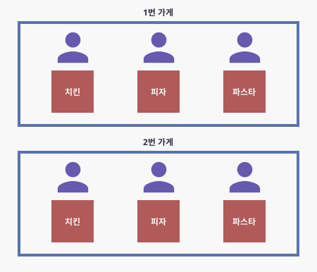
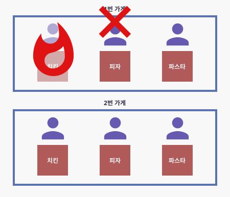

# 스레드와 프로세스

# 스레드와 프로세스란?

- 프로세스는 실행중인 프로그램 이다.
- 스레드란 프로세스 내에서 실행되는 단위 이다.

- 예를들어 한 가게에서 종업원이 치킨, 피자, 파스타 이렇게 3가지 품목을 판다고 가정해 보자.

- 이렇게 되면 가게는 프로세스라 볼 수 있고, 종업원은 스레드라 볼 수 있다.
- 종업원이 만약 한명이라서 치킨, 피자, 파스타 3개를 혼자 다 만든다고 하면 싱글 스레드로 작업을 한다고 보면 된다.

- 한명이 3개를 전부 만드는 것은 비효율 적이라고 생각해서 직원이 3명이 되서 한명은 치킨, 한명은 피자, 한명은 파스타 각각 다 맡아서 만든다고 해보자. - 이것을 멀티 스레드라고 한다
- 같은 가게 안의 같은 냉장고에서 재료를 공유하니깐 효율적이라는 장점이 있다.
- 하지만 여기서 한 재료를 여러명이서 동시에 건드려버리면 에러가 발생하므로 순서(동기화)를 잘 지정해 줄 필요성이 있다.

- 또 만약 요청이 많아져서 체인점으로 가게를 하나 더 늘린다고 가정해 보자.
- 여기서 1번 가게와 2번 가게의 냉장고는 각각 있으므로 서로 자원을 공유하지는 않는다.

- 여기의 장점은 만약 1번 가게에서 한 직원이 불을냈고 영업을 못하는 상황이있다고 해보자.
- 그렇게 되면 1번 가게에서 매출을 못 내더라도 2번 가게에서 매출을 내면 되는 상황이다.
- 만약 1번 가게를 나누지 않고 규모를 키워서 치킨 2라인, 피자 2라인, 파스타 2라인이였다면 한 라인에서 불이나서 작동이 안되는걸로 전부다 영업이 불가능한 상황이 된다.

## 정리

- 이렇게 예시를 들었는데 가게는 프로세스, 종업원은 스레드라 보면 된다.
- 예시에 나왔던 것 처럼 스레드는 작업하는 단위라 보면 되고
- 프로세스는 실행중인 프로그램이라고 보면 된다.
- 추가로 멀티 스레드는 같은 자원을 공유하기때문에 효율적이고 싱글스레드보다도 동시에 작업을 할 수 있어서 좋지만
  같은 자원을 공유하기때문에 synchronized 상황을 잘 만들면서 사용해야 한다.
- 또, 멀티 프로세스는 다른 프로세스와 독립적으로 작동하기 때문에 한 프로세스가 죽더라도 영향을 미치지 않고 실행 할 수 있다.
- 하지만 다른 프로세스들과 자원을 공유하는 건 아니기때문에 중복되는 자원이 있고, 또한 스레드보다 많은 메모리 공간이나 많은 cpu 를 잡아먹는다.
- 무조건적인 멀티스레드가 좋다, 멀티 프로세스가 좋다 이런건 없다. 상황과 목적에 따라 잘 나누어 사용해 보자.

참조

[https://www.youtube.com/watch?v=iks_Xb9DtTM](https://www.youtube.com/watch?v=iks_Xb9DtTM)

[https://wooody92.github.io/os/멀티-프로세스와-멀티-스레드/](https://wooody92.github.io/os/%EB%A9%80%ED%8B%B0-%ED%94%84%EB%A1%9C%EC%84%B8%EC%8A%A4%EC%99%80-%EB%A9%80%ED%8B%B0-%EC%8A%A4%EB%A0%88%EB%93%9C/)