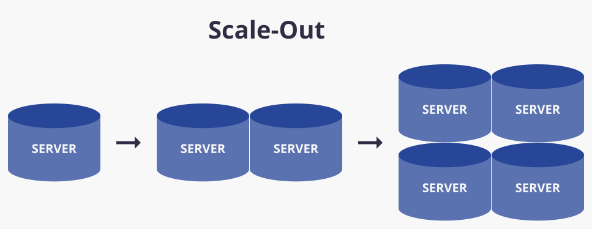

# Scale up/out

서비스 중인 프로젝트가 사용자가 많아진다고 가정해 보자.

클라이언트가 너무 많아져서 서버가 감당을 못한다고 가정하자 그러면 어떻게 해야할까??

서버가 대용량의 트래픽이 들어올때 해결하는 방법들로 Scale up / Scale out 두가지를 알아보자.

# 간단하게 각각 의 개념

### Scale-up

- scale-up 이란 서버의 성능을 향상시켜서 더 많은 요청을 처리하는 방법이다.
- 즉, 서버 하드웨어의 cpu, memory , 하드디스크 등을 업그레이드 또는 추가 하는 것을 말한다.

    

### Scale-out

- scale-out 이란 서버의 대수를 늘려서 더 많은 요청을 처리하는 방법이다.
- 즉, 서버 하드웨어 총 대수를 늘리는 방법이다.

    

좀 더 자세히 알아보자.

# Scale-up

## 장점

- 서버를 여러대 관리한다면 있을 수 있는 데이터 정합성 이슈에서 자유롭다.
- 구현하는게 간단하다 - 하드웨어 사서 늘리면 된다.
- 여러 사용하는 소프트웨어의 라이센스, 네트워크 인프라 등의 추가 비용이 발생하지 않는다.

## 단점

- 용량, 성능, 확장의 한계가 있다. - 가장 좋은 cpu, ram 등을 사용한다면 초과하는 성능으로 업그레이드 자체가 불가능하다.
- 비용이 비싼데 비용 대비 효과가 좋지 않다.
- scale-up 은 일정 수준을 넘어가면 성능 증가 폭이 미미해진다
    - cpu 같은 경우 i3 >> i5 보다 i5 >>i7 가 성능 상승치가 적다.
- 단일 서버로 운영하기 때문에 이 서버에 문제가 생기면 문제를 복구하고 다시 실행시킬 때까지 서비스를 중단해야 하는 상황이 올 수 있다.

# Scale-out

## 장점

- 용량, 성능 등의 확장에 한계가 없다. - 서버 대수를 늘리는 방법이기때문에 계속 추가하면 계속 확장이 가능하다.
- 한 서버 기기에서 장애가 발생하여 중단되더라도 다른 서버에서 돌아가고 있기때문에 장애 가능성이 감소한다.
- Scale-up 에 비해서 비용이 저렴하다.
- cloud 환경이나 대규모 서비스 등에서 권장되긴하지만 항상 정답은 아니다.
- 로드벨런싱**을 구현하여 트래픽을 각각 서버에 적절히 분해시킴으로서 병목현상을 줄일 수 있다.

## 단점

- 여러대의 서버를 사용하기 때문에 운영 비용이 증가한다.(라이센스 비용 등등)
- 치명적인 단점은 여러대의 서버를 사용함으로써 데이터 불일치가 잠재적으로 발생할 수 있다는 점이다.
- 데이터 일관성을 유지시키기 위해서 설계 및 관리가 복잡하다.
- 병렬 적으로 컴퓨팅 환경을 구성, 유지 시키려면 로드밸런싱에 대한 높은 이해도가 요구된다.
- 세션, 웹 이미지 등 서버에 저장되는 데이터를 어떤식으로 공유해야 할지에 대한 기술적인 한계가 있을 수 있다.

# ++로드벨런싱이란?(간단하게)

- Load Balancing
- 서버에 가해지는 부하를(=Load) 분산(= Balancing) 시켜주는 장치 또는 기술이다.

    

# 정리

- 서버 트래픽이 증가할 때 해결방법인 scale-up , scale-out 에 대해 알아보았다.
- scale-up 은 서버의 크기를 늘려 해결하는 방법이고, scale-out 은 서버의 대수를 늘려 해결하는 방법인데
- 위에 정리한 장,단점에 따라 필요한 상황을 이해하고 그에 맞는 것을 적용해야겠다.