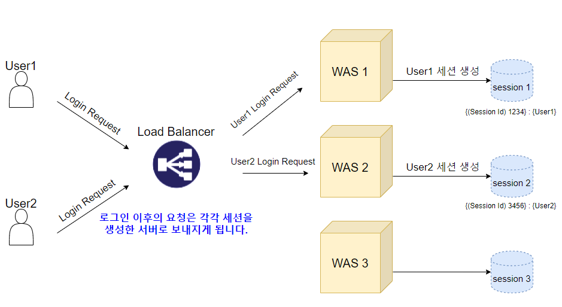
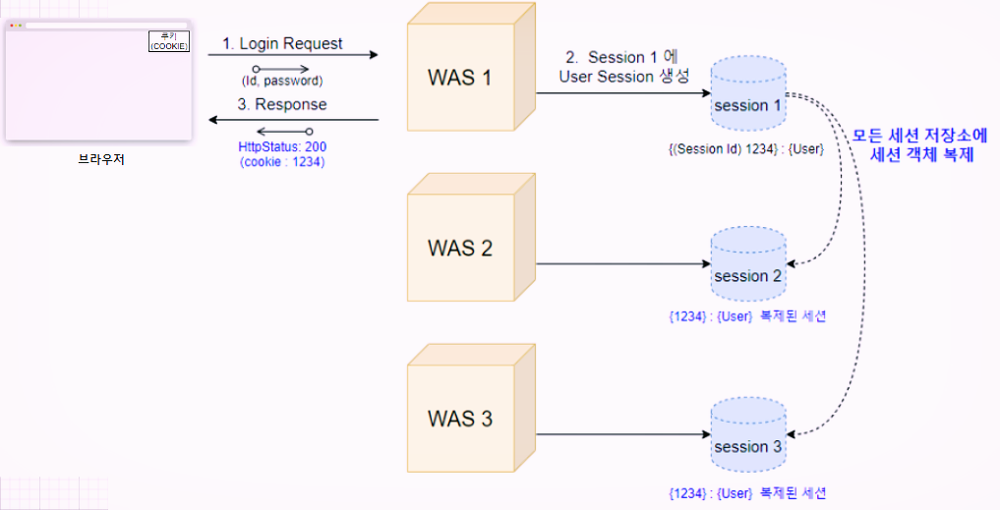
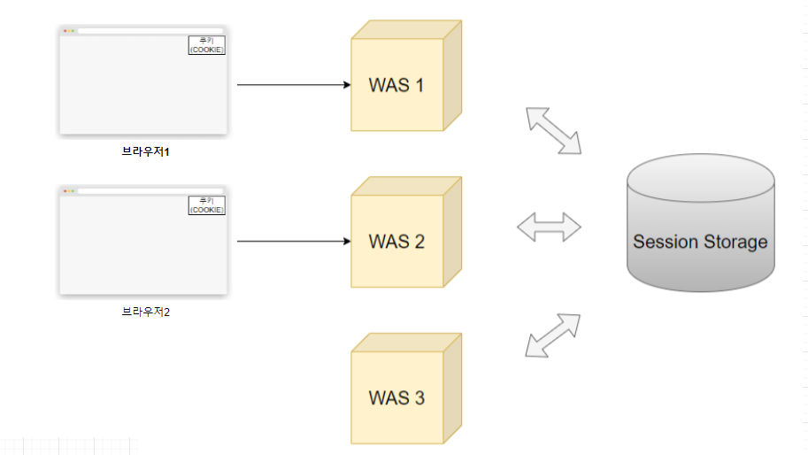

# 다중 서버 환경에서 Session 공유법

# 들어가며

- 서버가 여러대 있는 환경(Scale-out)에서는 로그인 환경 - 세션 처리를 어떻게 할까??
- 세션을 유지하는 3가지 방식을 알아보도록 하자.
- 

# Sticky Session

- 단어 그대로 고정된 세션이라는 것을 의미한다.

    

    (출처 : [https://junshock5.tistory.com/84](https://junshock5.tistory.com/84))

- 예를 들어 위 사진을 보자. 여기서 만약 User1이 WAS1 서버에서 세션을 생성하였다면, 이후에 User1 이 보내는 요청은 모두 Was1 에서 처리를 하도록 하는 방법이다.
- 로드 벨런서가 request 를 받을때 쿠키 여부를 확인 한 후 있다면 쿠키에 지정된 서버로만 요청을 보내게 됩니다.
- 같은 유저는 같은 서버만 이용하기 때문에 정합성 이슈에서 자유로워집니다.

### 문제점

- 특정유저가 특정 서버만 고정으로 사용한다는 것은 트래픽이 집중될 위험도 있다.(골고루 유저가 퍼지지 않을 수 있다.)
- 그리고 WAS1 서버가 죽으면 WAS1 관련 사용자들의 세션을 전부 잃어버리게 된다.
- 그래서 Sticky Session 은 가용성, 트래픽 분산을 완전하게 사용하지 못할 수 있다.

# Session clustering

### 클러스터링

- 여러대의 컴퓨터들이 연결되어 하나의 시스템처럼 동작하도록 만드는 것.
- DB가 두 대 이상 있을 때 한대가 장애가 나도 다른 DB 가 그 역할을 대신 수행하도록 하여 지속적인 서비스가 가능하게 하는 것.
- 세션 클러스터링은 여러 방법이 있다...

    

    (출처 : [https://junshock5.tistory.com/84](https://junshock5.tistory.com/84))

    - 그 중에 이런식으로 복제해서 저장시키는것도 클러스터링 방법중 하나가 될 수 있다.
    - 이렇게 하면 scale out 과 트래픽 분산을 이용할 수는 있지만,
    - 만약 WAS 가 세네개가 아닌 1000개 만개 이런식으로 늘어난다면 몇천개에 다 복제해야되니 낭비가 아닐 수 었다.

# Inmemory DB

(출처 : [https://junshock5.tistory.com/84](https://junshock5.tistory.com/84))

- 기존 서버가 가지고 있는 세션 저장소를 이용하는 것이 아니라, 별도의 세션 저장소를 사용하는것.
- 데이터 저장소의 메인 메모리에 설치되어 운영되는 방식의 DB 이다.
- 메모리 접근이기때문에 디스크 접근보다 빠르다.
- memcached , Redis 등이 있는데 Redis가 더 빠르다

### 단점

- 휘발성이기때문에 전원이 꺼지면 사라진다.

참조

[https://junshock5.tistory.com/84](https://junshock5.tistory.com/84)