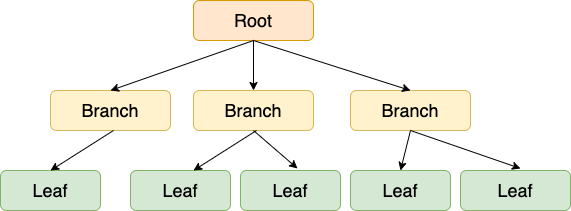

# B-tree / B+tree 와 Index

- B-tree , B+tree 는 Index 자료구조중의 하나이다
- MySQL 의 InnoDB 엔진에서는 B+tree 를 사용하는데 어떤것인지 알아보자.

# B-tree

- DB Index 에 한정 된 것이 아니라 b-tree 구조는 탐색 에서 짧은 시간안에 수행할 수 있기 때문에 소프트웨어 전반적으로 다 사용된다.

B-tree 는 데이터가 정렬된 상태로 유지되어 있다는 것이다.

- 그림에 표시된 사각형 하나하나의 데이터를 '노드(node) 라고 한다.
- 가장 상단을 '루트 노드', 중간을 '브랜치 노드', 가장 아래를 '리프 노드' 라고 한다.

### 왜 B-tree 는 빠를까?

- B-tree 를 사용하게 되면 아래와 같이 처리시간이 되는데 이는 왜 그럴까?

- 균일성 - 어떤 값에 대해서도 같은 시간에 결과를 얻을 수 있다.
    - 그렇다 보니 양이 많아지면 많아질수록 전부 탐색해야되는 풀 스캔보다 빠르게 된다.(균형이 안깨졌을 때 )

    

- B-tree 는 위 그림과 같이 균형트리로 생성이 되지만 INSERT, UPDATE, DELETE 를 자주 사용하게 되면 비균형 트리가 될 수 있으므로
- 인덱스 재구성을 해서 트리의 균형을 다시 잡는것이 중요하다.

# B+tree

- B-tree 의 확장 개념으로 , B-tree 는 internal 또는 branch 노드에 key 와 data 를 담을 수 있지만,
- B+tree 는 branch 노드에 key 만 담아두고, data 는 담지 않는다.
- 리프 노드에서만 key와 data 를 저장한다, 그리고 리프 노드끼리 Linked list 로 연결되어 있다.

### 장점

- 리프노드를 제외하고는 데이터를 담아두지 않기 때문에 메모리 확보가 더 되고, 더 많은 key 를 수용할 수 있게 된다.
- +하나의 노드에 더 많은 key들을 담을 수 있기 때문에 트리 높이도 낮아진다.
- 풀 스캔 시, B+tree는 리프 노드에 데이터가 있기 때문에 한번의 선형탐색만 하면 된다.(B-Tree는 모든 노드를 확인해야 한다.)

### ++InnoDB 에서 사용되는 B+tree

- +실제 적용되는것을 보면 단순 B+tree 보다 복잡해 보인다...
- (다음에 시간을 내서 좀 더 자세히 공부해 보자)

### 마치며

MySQL 에서 index 의 자료구조 중 핵심인 B+tree 를 알아보았다. 물론 실제 InnoDB 엔진에 사용되는것은 더 복잡하지만 index 가 어떤식으로 돌아가는 지 알아두면서 사용하는게 좋을 것 같다.

참고

[http://www.btechsmartclass.com/data_structures/b-trees.html](http://www.btechsmartclass.com/data_structures/b-trees.html)

[https://zorba91.tistory.com/293](https://zorba91.tistory.com/293)

[https://blog.naver.com/ya3344/221395287263](https://blog.naver.com/ya3344/221395287263)