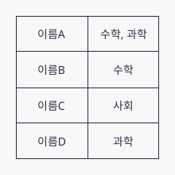
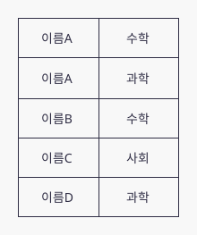
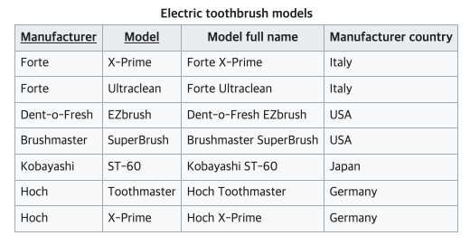
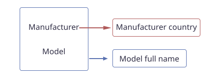
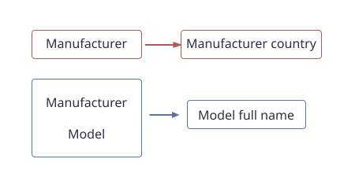
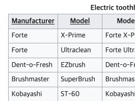
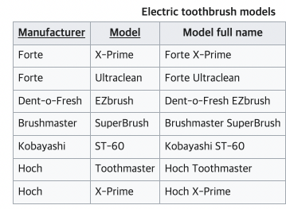
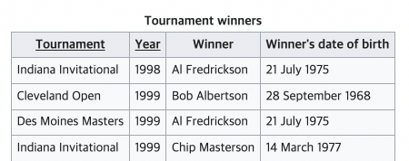
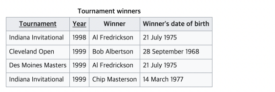

# DB 정규화란?

# DB 정규화란?

- 테이블간의 중복된 데이터를 최소화 하기위한 작업
- 중복된 데이터를 허용하지 않음으로써 무결성을 유지할 수 있으며 DB 의 저장 용량도 줄일 수 있다.
- 1 정규화~6 정규화, 사이에 여러 과정이 존재하지만 실무에선 보통 1~3단계까지의 정규화 과정을 거친다.

## 제 1 정규화(First Normal Form, 1NF)

- 테이블의 컬럼이 하나의 값(Atomic Value, 원자값) 을 갖도록 테이블을 분해하는 것이다.
- ex
    - 아래 이름 A 의 칼럼은 수학, 과학 두개가 있다. 이럴경우 1 정규형을 만족하지 못하므로 수학, 과학 두 개를 각각 하나씩 분리해서 만들어야 한다.

    

    

## 제 2 정규화(Second Normal Form, 2NF)

- 1정규화를 진행한 테이블에 대하여 완전 함수 종속을 만족한다.(부분 함수적 종속은 제거)
    - 함수적 종속 : X의 값에 따라 Y 값이 결정될 때 X → Y 로 표현하는데 이를 Y는 X 에 함수적 종속 이라고 한다.
    - 함수적 종속에서 X의 값이 여러 요소 일 경우 , {X1, X2} → Y 형태로 X1, X2 전부 Y 의 값을 결정할 때 이를 '완전 함수적 종속' 이라고 하고, X1,X2 둘 중 하나만 Y 값을 결정할 때 '부분 함수적 종속' 이라고 한다.
- 사실 무슨 말인지 글로 봐서는 햇갈린다. 다음 위키피디아 에서 들고온 예시를 보자
- ex

    

    - 위 표를 보게 되면 Manufacturer country 는 Manufacturer 을 의존한다고 봐도 된다.
    - 그러므로 {Manufacturer} → {Manufacturer country} 로 보아도 된다.
    - 그리고 {Manufacturer} 은 {Manufacturer, Model} 집합의 하위요소로 분류 할 수도 있다.
    - 그 다음 {Model full name} 은 {Manufacturer, Model} 을 의존한다고 볼 수 있으므로
    - {Manufacturer, Model} →{Model full name} 으로 볼 수 있다.

        

        간단하게 그림으로 종속(의존) 관계를 표현하면 이런식이다

        Manufacturer → Manufacturer country 는 부분종속적이라 볼 수 있고

        {Manufacturer, Model} → {Modl full name} 은 완전종속이라 볼 수 있다.

        2NF 는 부분 종속을 제거하는게 목표라고 했으니 부분종속을 없애며 나눈 그림은 다음과 같다.

        

        - 두 Table 로 나눔으로써 완전종속 두개의 Table 이 만들어졌다.
        - 이것을 표 내용으로 나누면 다음과 같다.

            

            {Manufacturer} → {Manufacturer country}

        

        {Manufacturer, Model} → {Model full name}

## 제 3 정규화(Third Normal Form, 3NF)

- 제 2 정규화를 만족해야 한다.
- 기본키가 아닌 모든 속성이 기본키에 Transaitive functional dependency (이행적 함수 종속?) 이 되지 않으면 3정규화에 속한다..
- 한글이 너무 어려우니깐 예시로 살펴보자
- ex

    

    - 위 표에서 Winner 를 자세히 보면 AI Fredrickson 이 두 번있고, Winner's date of birth 에 중복값이 있다.
    - 조금만 생각해보면 winner's date of birth 는 Tournament 에 종속적인 것이 아니라 winner 에 종속적인 것을 알 수 있다.
    - 이런 경우 3NF 를 만족하지 못한다고 하고, 만족시키기위해 아래와 같이 나누어야 한다.

    

참조

[https://wkdtjsgur100.github.io/database-normalization/](https://wkdtjsgur100.github.io/database-normalization/)

[https://en.wikipedia.org/wiki/Second_normal_form](https://en.wikipedia.org/wiki/Second_normal_form)

[https://en.wikipedia.org/wiki/Third_normal_form](https://en.wikipedia.org/wiki/Third_normal_form)