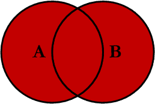
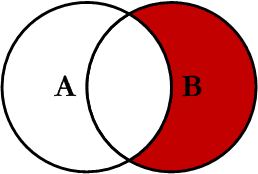
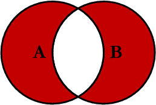

# Join 종류에 관하여

# Join 이란?

- 두개 이상의 테이블을 연결해서 데이터를 검색하는 방법
- 공유하는 컬럼이 적어도 하나 있어야 함

## 종류


- 위 사진처럼 집합이라고 생각하면 이해하기 쉽다.

([https://www.codeproject.com/Articles/33052/Visual-Representation-of-SQL-Joins](https://www.codeproject.com/Articles/33052/Visual-Representation-of-SQL-Joins))

### Inner Join


- 교집합인 부분만 select 된다.

```sql
--ex)
SELECT <select_list> 
FROM Table_A A
INNER JOIN Table_B B
ON A.Key = B.Key
```

### Left Join


- 왼쪽부분이 다 SELECT 된다고 생각하면 된다.

```sql
--ex)
SELECT <select_list>
FROM Table_A A
LEFT JOIN Table_B B
ON A.Key = B.Key
```

### Right Join


- 오른쪽 부분이 다 SELECT 된다고 생각하면 된다.

```sql
SELECT <select_list>
FROM Table_A A
RIGHT JOIN Table_B B
ON A.Key = B.Key
```

### Outer Join



- 양쪽 다 SELECT 된다.

```sql
SELECT <select_list>
FROM Table_A A
FULL OUTER JOIN Table_B B
ON A.Key = B.Key
```

---

### Left Excluding JOIN


- A 집합에서 교집합을 뺀다고 생각하면 편하다.
- left join 된 값 중에 B.key 가 null 인것을 찾는 방식으로 찾는다.

```sql
SELECT <select_list> 
FROM Table_A A
LEFT JOIN Table_B B
ON A.Key = B.Key
WHERE B.Key IS NULL
```

### Right Excluding JOIN



- B 집합에서 교집합된 부분을 뺀다고 생각하다.
- right join 된 값 중에 B.key 가 null 인것을 찾는 방식으로 찾는다.

```sql
SELECT <select_list>
FROM Table_A A
RIGHT JOIN Table_B B
ON A.Key = B.Key
WHERE A.Key IS NULL
```

### Outer Excluding JOIN



- A, B full outer join 한것에서
- 각각 null 인것을 찾는 방식으로 찾는다.

```sql
SELECT <select_list>
FROM Table_A A
FULL OUTER JOIN Table_B B
ON A.Key = B.Key
WHERE A.Key IS NULL OR B.Key IS NULL
```

참조

[https://www.codeproject.com/Articles/33052/Visual-Representation-of-SQL-Joins](https://www.codeproject.com/Articles/33052/Visual-Representation-of-SQL-Joins)