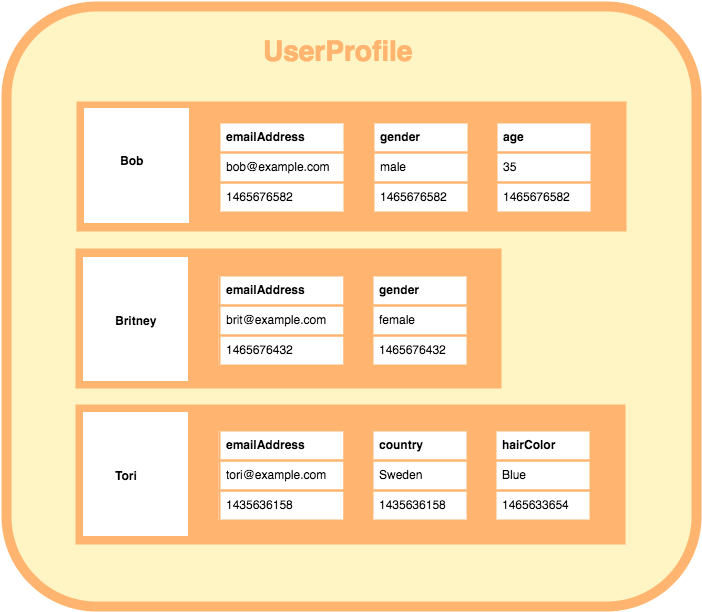
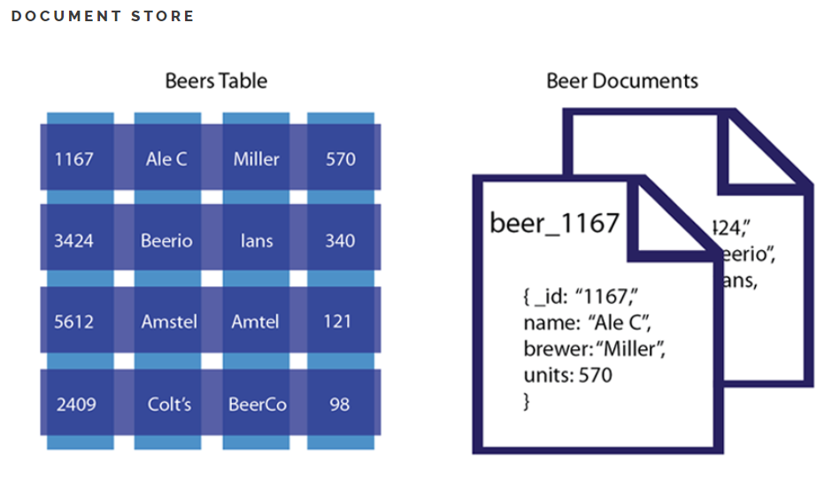
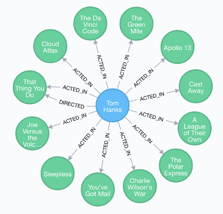

# Redis 란??

- 일단 레디스 설명 전에 NoSQL 부터 알아보자

# NOSQL 이란?

- Not Only SQL
- RDBMS 이 관계형 데이터 베이스라면 , NOSQL 은 비관계형 데이터 베이스이다.
- key-value, colum, 문서 형식의 데이터 모델을 사용한다.

## 왜 필요할까??

- 아주 많은 양의 데이터를 효율적으로 처리가 필요할 때, 데이터의 분산처리, 빠른쓰기 및 데이터의 안정성 등이 필요할때 사용한다.
- 특정 서버에 장애가 발생했을 때에도 데이터 유실 또는 서비스 중지가 없는 형태의 구조이다.

## NOSQL 종류

- key-value 스토리지형
    - key-value 로 저장되는 구조로 속도가 빠르고 분산 저장시 용이하다.

        

    - Redis, memcached, Coherence, Oracle NoSQL Databvase 등등
- Wide Column Database
    - 행마다 기와 값을 저장할 때마다 각각 다른값의 다른수의 스키마를 가질 수 있다.

        

    - Cassandra, HBase, Google BigTable, Vertica 등등
- Document Database
    - 테이블이 스키마가 유동적이다.
    - 레코드마다 다른 스키마를 가질 수 있다.
    - 트리형 구조로 레코드를 저장하거나 검색하는데 좋은 DB

        

    - MongoDB, Azure Cosmos DB, CouchDB 등등
- Graph Database
- 데이터를 노드로 표현하며, 노드 사이의 관계를 엣지로 표현
- RDBMS 보다 성능이 좋고 유연하고 유지보수가 좋다.

    

- Neo4j, Blazegraph, OrientDB 등등

# Redis(레디스) 란??

- 그럼 Redis 란 뭐고 특징은 뭐가 있을까 알아보자.
- key-value 형태의 저장소이다.
- in-memory 형태이다
- 크게 String,  List, Hash, Set, Sorted Set등 여러 형식의 자료구조를 지원한다.

### 특징

- in-memory 에 key-value 형식이라 매우 빠르다.
- in-memory 라 메모리가 이상이 생기거나 재시작할 시 데이터가 다 날아간다.
- (Redis 는 메모리와 디스크에 저장되서 불의의경우 데이터 복구도 가능하다)
- 대형 포털사이트 들에서 static page, 또는 검색 결과 등을 캐쉬하는데 많이 사용한다.
- 읽기 성능 증대를 위한 서버 측 복제를 지원한다.
- 쓰기 성능 향상을 위한 클라이언트 측 샤딩(sharding)을 지원한다.

### 장점

- list 형 데이터 입력과 삭제가 MySQL 에 비해 10배 정도 빠르다고 한다.
- 메모리를 활용하면서 영속적인 데이터 보존 가능
- Redis server는 1개의 싱글 쓰레드로 수행되며, 따라서 서버 하나에 여러 개의 서버를 띄우는 것이 가능하다.