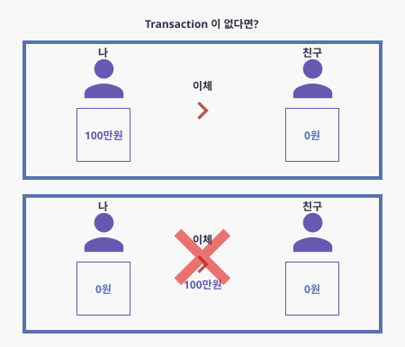

# Transaction 이란?

# 트랜젝션이란?

- 트랜잭션이란 간단하게 쪼개질 수 없는 없무처리의 단위 라고 보면 될꺼같다.
- 왜 필요한가?

    많이 사용 하는 예시처럼 은행을 예로 들어보자
  
    내가 100만원을 친구에게 이체 하려고 한다.

    나에게 돈이 100만원이 빠져나갔는데 친구에게 100만원이 들어가지 않고 서비스가 종료 됬다고 해보자.

    

    정말 큰일이다!! 내 돈은 빠졌는데 친구에게는 100만원이 다 전달이 되지 않았기 때문이다.

    이럴 때 은행에서 '내 돈 100만원이 빠지는 순간부터 친구에게 100만원이 들어가는 순간' 까지의 과정을

    한 업무 처리과정으로 보고 하나라도 정상적으로 되지 않으면 돌아가도록 설정해야 한다. 이걸 트랜잭션의 간단한 예시라 보면 될 것 같다.

## DB Transaction 특징(ACID)

### 원자성(Atomicity)

- 부분적으로 실행되다가 중단되지 않는것을 보장하는 능력이다.
- 작업이 3개 묶음으로 실행된다면 1개만 실행되고 2개 는 실행 안되는 그런것이 아니라, 3개 모두 실행안되거나 3개 모두 실행되도록 처리한다는 것이다.
- 간단하게 성공(commit), 혹은 실패(rollback) 둘중 하나만 한다는 것이다.

### 일관성(Consistency)

- 트랜잭션 완료 후에도 일관된 상태로 유지되어야 한다.
- 위의 예와 같이 이체가 끝난후 A, B 의 잔액의 합이 트랜잭션 실행 전과 후의 합이 동일해야 된다.

### 독립성(Isolation)

- 하나의 트랜잭션이 실행하는 도중에 변경하는 데이터는 다른트랜잭션이 참조하지 못해야 한다.
- 예를 들어 위의 이체 과정 중에 100만원이 이동하는 도중에 딴사람이 이체를 추가한다거나 할 수 없고, 이 100만원 이체하는 작업이 끝난 후에 작업을 시작할 수 있도록 해야 한다는 것이다.

### 지속성(Durability)

- 트랜잭션이 완료되면 주기억장치가 아닌 디스크와 같은 보조기억장치에 저장되거나 그렇지 않더라고 시스템 장애가 회복되고 난 후에 어떠한 형태로든지 그 데이터를 복구 할 수 있게 해야함을 뜻합니다.
- 간단하게 로그에 저장된 후에야 commit 상태로 간주 될 수 있다고 봐도 될 것 같다.

## Transaction 의 상태

### Active(활동)

- 트랜잭션이 실행중에 있는 상태, 연산들이 정상적으로 실행 중인 상태

### Failed(장애)

- 트랜잭션 실행애 오류가 발생하여 중단된 상태

### Aborted(철회)

- 트랜잭션이 비정상적으로 종료되어 Rollback 연산을 수행한 상태

### Partially Committed(부분 완료)

- 트랜잭션의 마지막 연산까지 실행했지만, commit 연산이 실행되기 전의 상태

### Committed(완료)

- 트랜잭션이 성공적으로 종료되어 Commit 연산을 실행 한 수의 상태

참조

[https://limkydev.tistory.com/100](https://limkydev.tistory.com/100)