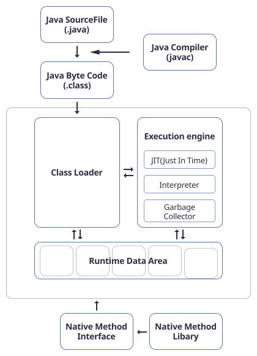
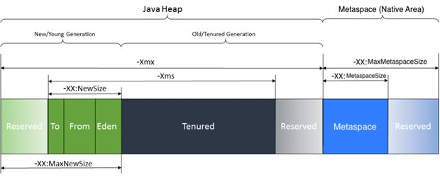
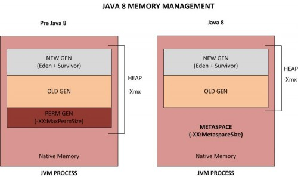

# JVM 메모리 구조

## JVM 이란?

- Java Virtual Machine 의 약자이며 자바 가상머신 , 자바 바이트 코드를 실행할 수 있는 주체라고 보면 된다.
- 자바 코드를 컴파일해서 얻은 '바이트 코드' 를 해당 '운영체제가 이해할 수 있는 기계어' 로 바꿔 실행시켜주는 역할을 하기 때문에 OS 의 종류에 상관 없이 실행이 가능하다

## JVM 구조

### Runtime 시의 JVM 구조

위쪽부터 실행 순서대로 보면

1. 프로그램 실행 시 JVM은 OS로부터 메모리를 할당
2. 자바 컴파일러(javac)가 자바 소스코드(.java)를 자바 바이트코드(.class)로 컴파일
3. Class Loader를 통해 JVM Runtime Data Area로 적재하는 역할 수행
4. Class Loader에 의하여 로딩 된 .class들은 Execution Engine을 통해 해석되어 각 역할에 맞추어 수행된다.
    - Interpreter - ByteCode 를 기계가 이해할 수 있도록 Native Code로 바꾸는 작업을 함
    - JIT(Just In Time) Compiler - Interpreter 의 효율을 높이기 위해 JIT 컴파일러로 반복되는 코드를 모두 Native Code 로 바꾼다
    - Garbage Collector(GC) - Runtime Data Area 의 Heap 영역에있는 참조되지 않는 객체를 정리한다

### JVM Memory 구조

Runtime Data Area

- JVM 의 메모리 영역으로 자바 어플리케이션을 실행할 때 사용되는 데이터들이 적재되는 영역이다.

1. Method area(메소드 영역)
    - 모든 Thread 에 공유 됨
    - Class Loader 가 적재한  클래스(또는 인터페이스) 에 대한 메타데이터 정보가 저장된다.
    - **전역변수 와 정적 멤버변수(static 변수) 는 이 영역에 저장되므로 프로그램시작부터 종료될 때 까지 메모리에 남아있게 된다. 그래서 전역변수는 프로그램이 종료될 때까지 어디서든 사용 가능하게 된다.
    - 자세히 보면 Type Information(타입정보), Runtime Consatant Pool(런타임 상수 풀), Field Information(필드 정보), Method Information(메소드 정보), Class Variable(클래스 변수) 가 있다.
    - 그 중 Runtime Constant Pool 은 Type, Field, Method로의 모든 레퍼런스를 저장하는데, JVM 은 이 영역을 통해 실제 메모리 상의 주소를 찾아 참조한다.

2. Heap area(힙 영역)
    - 모든 Thread 에 공유 됨
    - 동적 데이터가 할당되어 저장된다.(new 명령으로 만드는거는 다 여기 해당한다고 보면 된다.)
    - GC의 동작 대상이며 레퍼런스(참조)가 없는 객체들은 GC동작 과정에 따라 메모리에서 제거된다.
    - Heap 영역은 크게 Eden(Young Generation), Survivor 1 & 2(Young Generation), Old(tenured generation), Permanent(JDK 8부터 삭제되고, 이 기능을 Metaspace 가 함)
    - 하단에 자세하게 설명

3. Stack Area(스택 영역)
    - Thread 별로 1개씩 존재
    - 자바에서 메소드를 호출할 때 메소드의 Stack Frame 이 저장되는 영역
    - Stack Area 에 저장되는 변수는 기본자료형(int, double, long, float), 참조자료형(주소값)
    - ** 메소드 호출이 끝나면 Stack 내 메소드 관련 지역변수도 지워지기 때문에  메소드 영역 밖에서는 사용할수 없는 이유가 된다.

    - stack area 의 동작과정
        1. 자바는 스레드를 생성하지 않았다면 main 스레드만 존재하고 그에 따라 stack frame도 한개만 있다.
        2. 그 과정에서 메서드를 호출하면 stack프레임을 하나 새로 생성(push)된다
        3. 그리고 그 안에 메서드와 관계된 지역변수, 매개변수 등을 스택 영역에 저장한다.
        4. 이렇게 스택 영역은 메소드의 호출과 함께 할당되고 메소드의 호출이 완료되면 소멸(pop)한다.

4. PC Resisters(PC 레지스터)
    - Thread 별로 1개씩 존재
    - 현재 실행중인 JVM 의 명령주소(Program Counter) 를 갖고 있는 영역이다.
    - Java 의 PC Resister 는 Cpu 내의 기억장치인 레지스터와는 다르게 동작한다.

5. Native Stack(네이티브 스택)
    - Java 이외의 언어로 만들어진 코드를 실행하기위한 stack
    - JNI(Java Native Interface) 를 통해 호출되는 C/C++ 등의 코드를 실행가기 위함
    - JVM 내부에 영향을 주지 않기 위해 따로 메모리 공간을 활용함

## +Heap 영역

([https://sgcomputer.tistory.com/64](https://sgcomputer.tistory.com/64) 참조)

(아래 이미지는 java 1.7의 힙 구조임)

- java 1.8 부터 perm 이 Metaspace 영역으로 넘어갔다.(단, static Object 는 Heap 영역으로 옮겨졌다) metaspace 는 아래에 나누어서 또 설명하도록 해보자
1. Eden(Young Generation)
    - 객체가 생성되면 처음 저장되는 공간으로, Eden의 공간이 다 차게되면 해당 데이터는 Survivor 1로 복사가 되는데 이 때 쓸모없는 데이터는 Minor GC에 의해 삭제된다.
2.  Survivor 1 & 2(Young Generation)
    - Eden에서 살아남은 데이터가 옮겨진다.
    - Survivor 영역이 꽉 차게 되면 다른 Survivor 영역으로 이동하게 된다. 이 때, Eden 영역에 있는 객체들 중 살아있는 객체들도 다른 Survivor 영역으로 간다. 즉, Survivor 영역의 둘 중 하나는 반드시 비어 있어야 한다.
    - 이렇게 이동하면서 쓸모 없는 데이터는 Minor GC 에 의해 삭제되고 오래 살아있는 데이터는 Old 로 데이터를 보낸다
3. Old(tenured generation)
   - Young Generation(Survivor영역) 에서 오래 살아남은 객체가 저장되는 곳
   - 보통 굉장히 오래 사용하고, 크기가 큰 객체가 대부분이며 여기 Old 의 공간이 다 차게되면 Minor 가 아닌 Major GC 가 실행된다.
   - Major GC 는 객체들이 살아있는 여부를 파악하기위해서 모든 쓰레드의 실행을 멈추고 heap을 정리하기 때문에 자원과 시간을 많이 소모한다.

## java 8 에서 변경점(Permanent Generation 이 사라지고 Metaspace 가 추가)

### Permanent Generation 의 특징

- Class 메타 데이터 저장
- Method 메타 데이터 저장
- static object 변수, 상수 저장
- Heap 영역

### Java 8 에서 어떻게 변경되었는가

- Perm 에서의 대부분의 기능이 Metaspace 로 넘어갔지만, 'Static Object 변수, 상수' 부분은 Heap 영역으로 이동해서 GC 의 대상이 될 수 있도록 되었다.
- Metaspace 는 Native Memory 영역이다.(Heap 영역은 JVM 에 관리되고, Native memory 는 OS 레벨에서 관리하는 영역이다)
- metaspace 로 이동함으로써 메모리 영역 확보의 상한을 크게 의식할 필요가 없어지게 되었다.

참조 :

[https://docs.oracle.com/javase/specs/jvms/se8/html/jvms-2.html](https://docs.oracle.com/javase/specs/jvms/se8/html/jvms-2.html)

[https://sgcomputer.tistory.com/64](https://sgcomputer.tistory.com/64)

[https://yaboong.github.io/java/2018/05/26/java-memory-management/](https://yaboong.github.io/java/2018/05/26/java-memory-management/)

[https://velog.io/@jsj3282/JVM과-자바-메모리-구조Runtime-Data-Area](https://velog.io/@jsj3282/JVM%EA%B3%BC-%EC%9E%90%EB%B0%94-%EB%A9%94%EB%AA%A8%EB%A6%AC-%EA%B5%AC%EC%A1%B0Runtime-Data-Area)

[https://medium.com/platform-engineer/understanding-java-memory-model-1d0863f6d973](https://medium.com/platform-engineer/understanding-java-memory-model-1d0863f6d973)

[https://johngrib.github.io/wiki/java8-why-permgen-removed/](https://johngrib.github.io/wiki/java8-why-permgen-removed/)

(java 7, 8 memory 영역 변경점 참조)

(metadata 부분 관련 참조)

[http://karunsubramanian.com/websphere/one-important-change-in-memory-management-in-java-8/](http://karunsubramanian.com/websphere/one-important-change-in-memory-management-in-java-8/)

[https://goodgid.github.io/Java-8-JVM-Metaspace/](https://goodgid.github.io/Java-8-JVM-Metaspace/)

[https://www.whatap.io/ko/blog/57/](https://www.whatap.io/ko/blog/57/)

(out of memory error 관련)OOEM

[https://m.post.naver.com/viewer/postView.naver?volumeNo=23726161&memberNo=36733075](https://m.post.naver.com/viewer/postView.naver?volumeNo=23726161&memberNo=36733075)